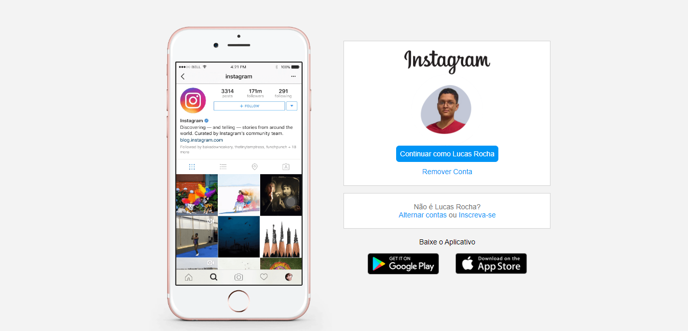

# 📸 Clone do Instagram

Este projeto é um clone do Instagram feito no Bootcamp da plataforma DIO.

Link da Página -> https://luckasrocha.github.io/Clone-do-Instagram/

## Ferramentas Utilizadas

* Conhecimentos básicos

* Conhecimentos básicos
* Flexbox
* Media Queries
